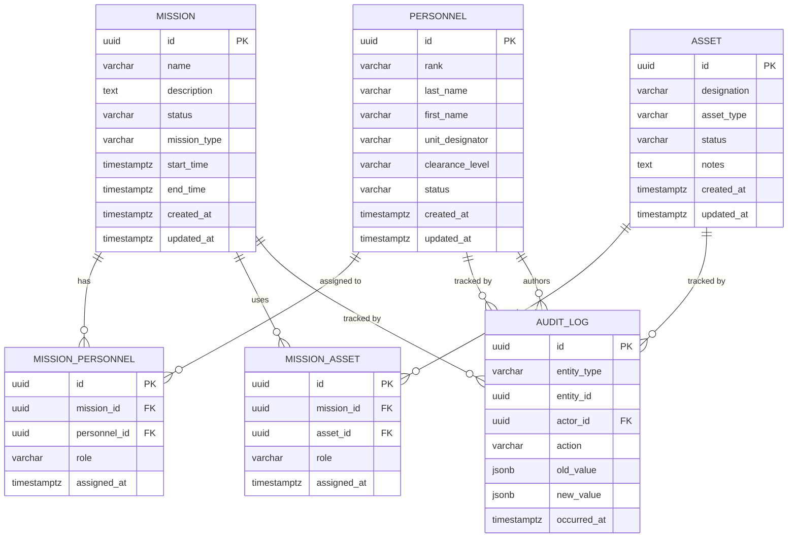

# Garrison Entity Relationship Diagram

```mermaid
erDiagram
  MISSION {
    uuid        id           PK
    varchar     name
    text        description
    varchar     status
    varchar     mission_type
    timestamptz start_time
    timestamptz end_time
    timestamptz created_at
    timestamptz updated_at
  }

  PERSONNEL {
    uuid        id              PK
    varchar     rank
    varchar     last_name
    varchar     first_name
    varchar     unit_designator
    varchar     clearance_level
    varchar     status
    timestamptz created_at
    timestamptz updated_at
  }

  ASSET {
    uuid        id          PK
    varchar     designation
    varchar     asset_type
    varchar     status
    text        notes
    timestamptz created_at
    timestamptz updated_at
  }

  MISSION_PERSONNEL {
    uuid        id           PK
    uuid        mission_id   FK
    uuid        personnel_id FK
    varchar     role
    timestamptz assigned_at
  }

  MISSION_ASSET {
    uuid        id         PK
    uuid        mission_id FK
    uuid        asset_id   FK
    varchar     role
    timestamptz assigned_at
  }
  
  AUDIT_LOG {
    uuid        id          PK
    varchar     entity_type
    uuid        entity_id
    uuid        actor_id    FK
    varchar     action
    jsonb       old_value
    jsonb       new_value
    timestamptz occurred_at
  }

  MISSION   ||--o{ MISSION_PERSONNEL : "has"
  MISSION   ||--o{ MISSION_ASSET     : "uses"
  PERSONNEL ||--o{ MISSION_PERSONNEL : "assigned to"
  ASSET     ||--o{ MISSION_ASSET     : "assigned to"
  MISSION   ||--o{ AUDIT_LOG         : "tracked by"
  PERSONNEL ||--o{ AUDIT_LOG         : "tracked by"
  ASSET     ||--o{ AUDIT_LOG         : "tracked by"
  PERSONNEL ||--o{ AUDIT_LOG         : "authors"
```
